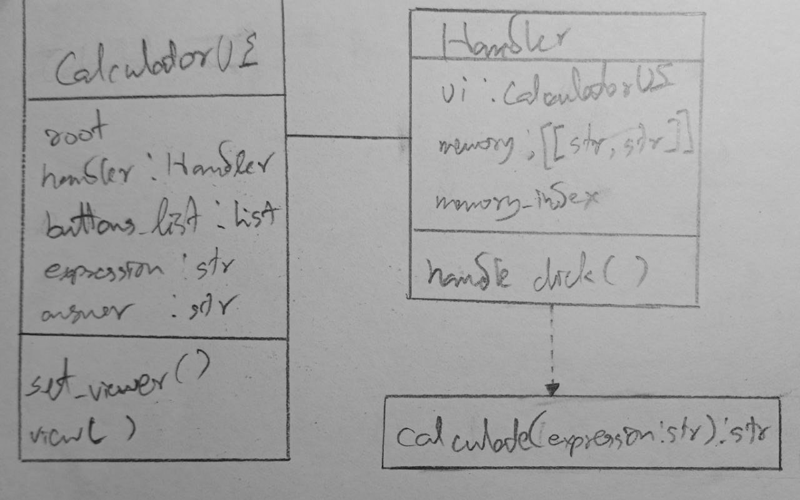

# Calculator Application

This is a simple calculator application built with Python and Tkinter. It provides basic arithmetic operations and some advanced mathematical functions.

## Classes

The application consists of two main classes:

1. `CalculatorUI`: This class is responsible for setting up the user interface of the calculator. It creates the buttons for the calculator and displays the expression and answer.

2. `Handler`: This class handles the button clicks and performs the calculations. It also manages the memory for storing previous calculations.

## Usage

To use the calculator, simply run the script. A window will open with the calculator interface. You can input expressions using the buttons on the calculator. The result will be displayed on the screen.

## Features

- Basic arithmetic operations: addition, subtraction, multiplication, and division.
- Advanced mathematical functions: power, square root, logarithm, and modulo.
- Memory function: You can navigate through your previous calculations using the up and down arrows.

